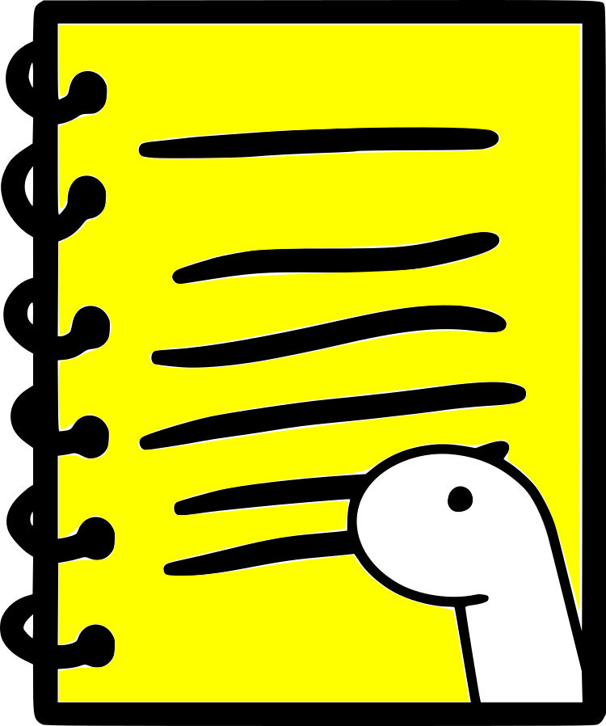

<div align="center">
   
   <h1>Denosk</h1
      
**The task runner for Deno**
      
   Denosk is a task runner for Deno, if you come from Node JS with the Yarn package manager and you miss being able to run a script with **yarn dev** or **yarn start** and you want to avoid writing commands like **deno task dev** or **trex run dev** then Denosk is for you.

   **Also with Denosk you can also create tasks from the terminal.**

   <a href="https://www.buymeacoffee.com/erikgiovani" target="_blank">
      
   </a>
</div>

<div align="center">
   <h2>Installation</h2>
   

```bash
deno install -A --unstable -n dn --no-check https://deno.land/x/denosk/cli.ts

   ```
</div>

<div align="center">
   <h2>Permissions</h2>
   
The permissions that Denosk uses are **--allow-read**, **--allow-write** and **--allow-run** .
</div>

<div align="center">
   <h2>Usage</h2>
   
To display help on how to use Denosk.
```bash
dn help
```

To display all tasks from your deno.json, deno.jsonc or run.json file if you are using Trex scripts.
```bash
dn
```

To execute a task found in your deno.json, deno.jsonc or run.json file if you are using Trex, with Denosk just pass the name of the task to be executed after the word **dn** as in the following example.
```bash
dn start
```

To create a task you need to pass the name of the task after the **task** argument followed by the task with quotes, how in this example:
```bash
dn task dev "deno run --watch main.ts"
```

**You can also create a task without having a deno.json file, when creating the task Denosk will create the file and include the task in it, this feature only works on deno.json files for this moment.**
</div>


<div align="center">
   <h2>Why Denosk?</h2>
   
Denosk is born from a combination between the word **Deno** and the word **Task**, it's that simple.
</div>
